<h2 align=center>Lecture 01</h2>

<h1 align=center>A Soft Introduction To Web Design</h1>

<h3 align=center>1 Germinal, Year CCXXXI</h3>

***Song of the day:*** _[**愛の讃歌 (Hymn to Love)**](https://youtu.be/pJXAJMcom0s) by UlulU (2022)._

---

### Sections

1. [**Installing The Tools You Need**](#part-1-installing-the-tools-you-need)
2. [**Getting Stuff Up On Your Screen**](#part-2-getting-stuff-up-on-your-screen)
    1. [**Opening Your Project**](#step-1-opening-your-project)
    2. [**Creating Your `html` File**](#step-2-creating-your-html-file)
    3. [**Copy And Paste The Starter Code**](#step-3-copy-and-paste-the-starter-code)
    4. [**Run Your Website**](#step-4-run-your-website)
    5. [**Write Something, And Make It Nice**](#step-5-write-something-and-make-it-nice)
3. [**Homework**](#part-3-homework)

### Part 1: _Installing The Tools You Need_

<!-- TODO -->

### Part 2: _Getting Stuff Up On Your Screen_

Before we learn about anything related to this stuff, let's make sure that you can, at the very least, get _something_ on the screen. Using VSCode, open the folder in which you are saving your files for each lecture:

#### STEP 1: Opening Your Project

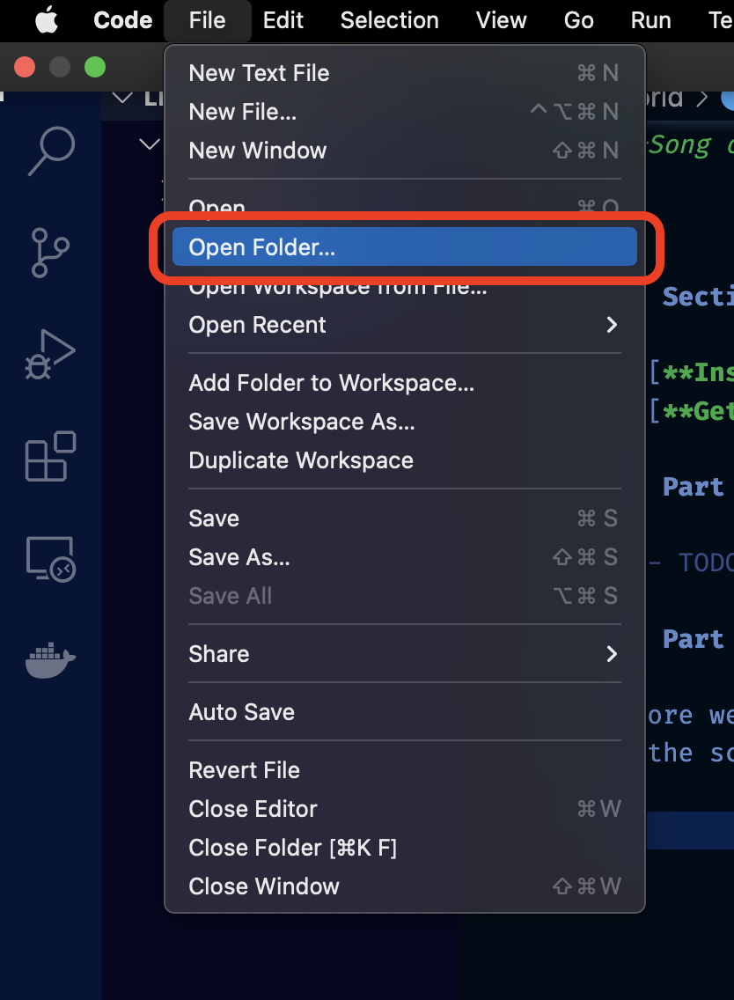

<sub>**Figure 1**: In the `File` dropdown menu, select `Open Folder...`.</sub>

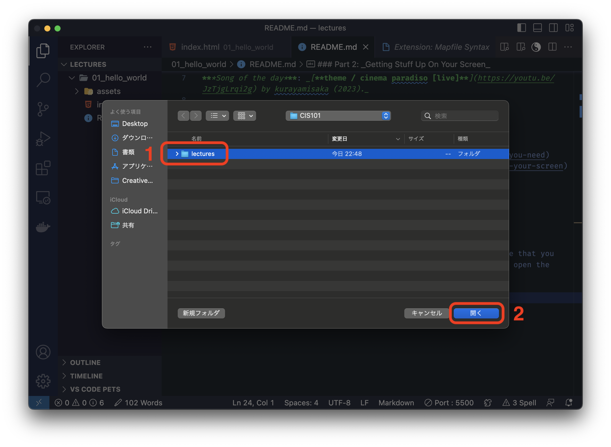

<sub>**Figure 2**: Navigate to the folder in which you are saving your files for this lecture. Click on it **once**, and then click the `Open` button.</sub>

Once you open this folder on VS Code, you should see something like this on your window:

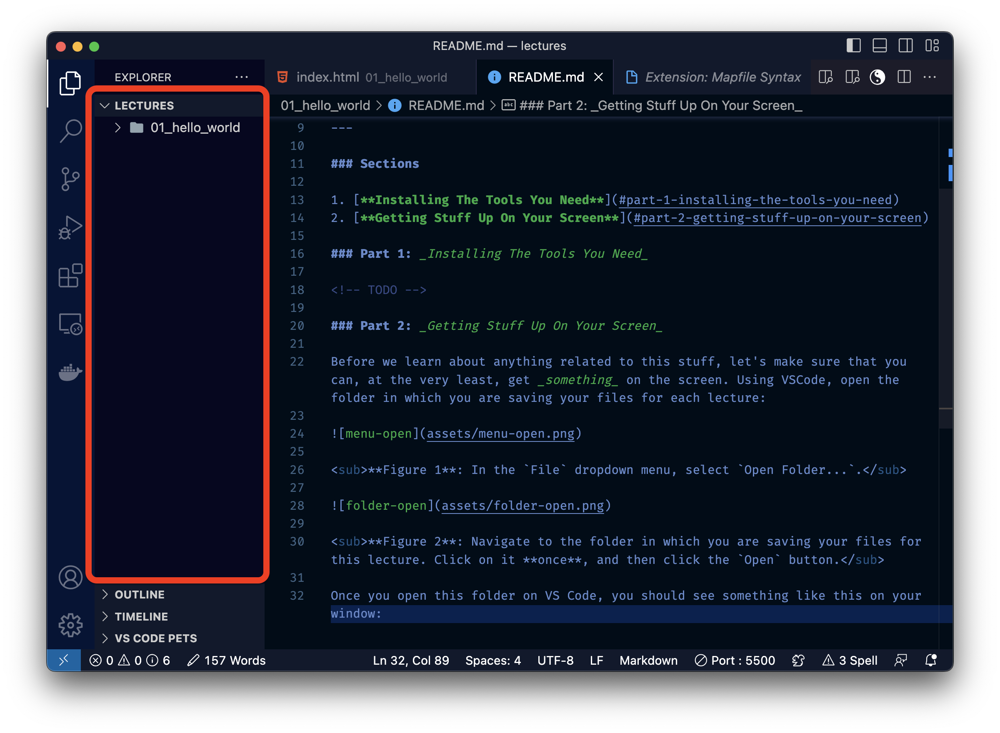

<sub>**Figure 3**: This section is call the file `Explorer`. I already have something in it (a sub-folder called `01_hello_world`) but, for you, it should be empty.</sub>

#### STEP 2: Creating Your `html` File

Every web design project needs a file called `index.html`. We can easily create this file by going into the file `Explorer` and clicking the following button:

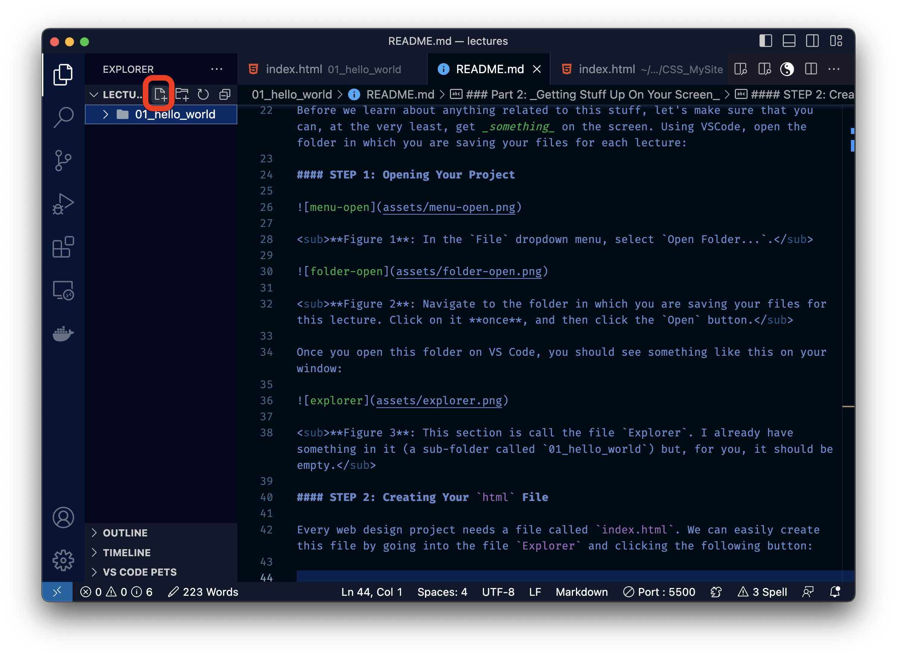

<sub>**Figure 4**: The `New File` button.</sub>

Once you create a file called `index.html` (and you have to make sure that it has that exact name), your screen should look something like this (my file `Explorer` has a few extra things that you won't have):

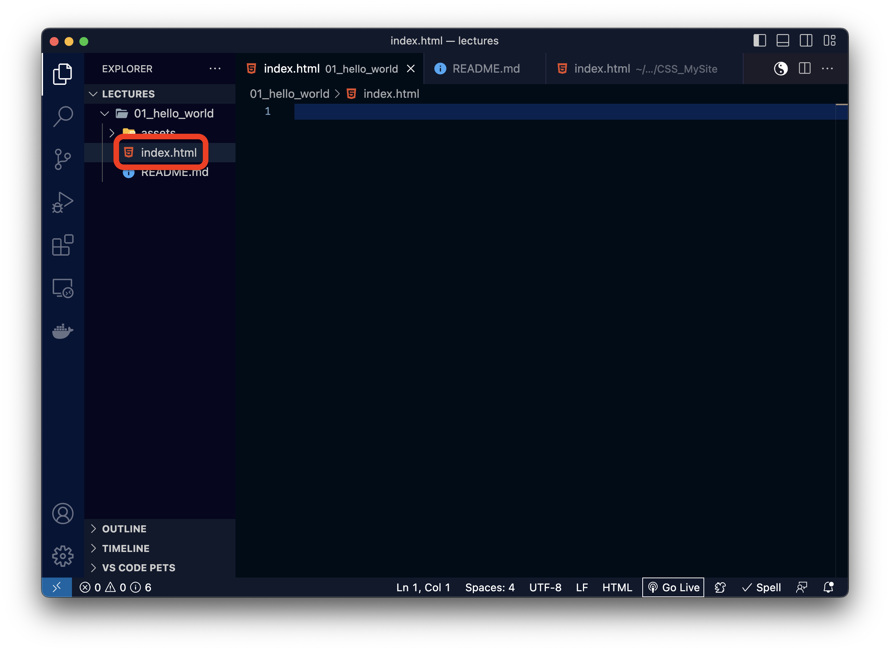

<sub>**Figure 5**: Ah yes, a fresh canvas.</sub>

#### STEP 3: Copy And Paste The Starter Code

Alright. The first thing you're gonna wanna do is copy-and-paste the following piece of code into your `index.html` file:

```html
<!DOCTYPE html>
<html lang="en">
    <!-- Website Head -->
    <head>
        <meta charset="UTF-8">
        <meta http-equiv="X-UA-Compatible" content="IE=edge">
        <meta name="viewport" content="width=device-width, initial-scale=1.0">
        <title>Document</title>
    </head>


    <!-- Website Styling -->
    <style>

    </style>


    <!-- Website Content -->
    <body>

    </body>


    <!-- Website Interactivity -->
    <script>

    </script>
</html>
```

<sub>**Code Block 1**: This is the starter code for all web design homework assignments and for your final project.</sub>

#### STEP 4: Run Your Website

Once you have done this, go ahead and click on the `Go Live` button at the bottom left of your screen. This should open your browser automatically into a completely blank page:

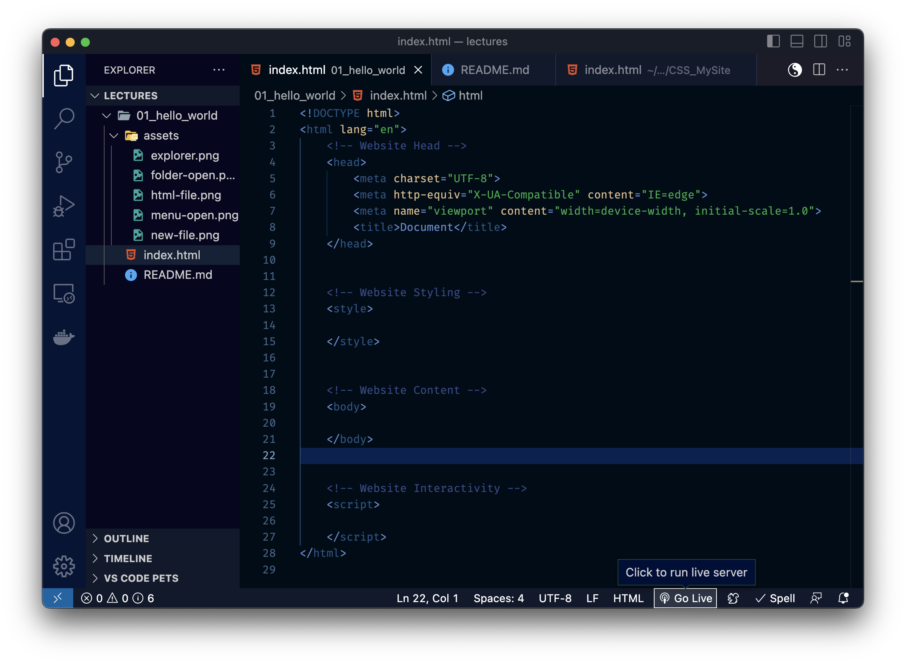
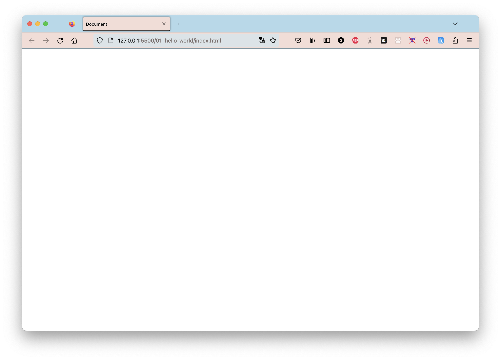

<sub>**Figures 6 and 7**: Where to find the `Go Live` button, and the resulting blank browser screen. Please note that this will only work if you have a `.html` file open.</sub>

What's happening here? To put it simply, VSCode is creating its own mini-server in your computer, and it is using it to run your website locally. Nobody else can access your website through an internet browser (yet) since it is a local server, but this is perfectly fine for now. Baby steps.

#### STEP 5: Write Something, And Make It Nice

The best way to get started with web development is by literally just trying stuff and see if it works. In the `<body></body>` part of your `index.html` file, go ahead and write the following:

```html
<!-- Website Content -->
<body>
    Hello, World!
</body>
```

<sub>**Code Block 2**: Every programmer's first line of code.</sub>

If you closed your server before doing this part, go ahead and click on the `Go Live` button again. Otherwise, go ahead and look at your browser window again:

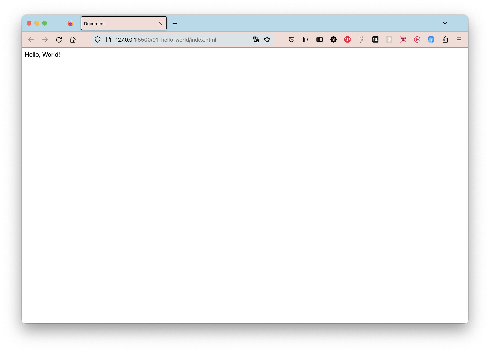

<sub>**Figure 8**: There you go; what you wrote in your `index.html` file was reflected in your website.</sub>

It's not the nicest piece of web design ever, but it's a start. Let's try to make it look a little bit nice. Let's say we wanted the text `Hello, World!` to look more like the title, or **header**, of our website. For this, try writing the following in your `<body></body>` instead:

```html
<!-- Website Content -->
<body>
    <h1>Hello, World</h1>
</body>
```

<sub>**Code Block 3**: Making `Hello, World!` the header of our website. Note the `/` in the tail of the `<h1>` tag.</sub>

And check out the change reflected on your website:


<sub>**Figure 9**: Hello, large text.</sub>

What we've just done is, quite literally, turned `Hello, World!` from plain old text into a nice, official header using the _`<h1></h1>`, or header one, **HTML tag**_. Tags are the bread and butter of structuring your website, and there are [**a lot of them**](). We'll talk about a few of the most popular ones today.

---

Another very common HTML tag is the **paragraph**, or `<p></p>`, tag. This tag is most often used to write the main text of a website. So, for instance:

```html
<!-- Website Content -->
<body>
    <h1>Hello, World</h1>

    <p>Hello, this is my first website.</p>
</body>
```

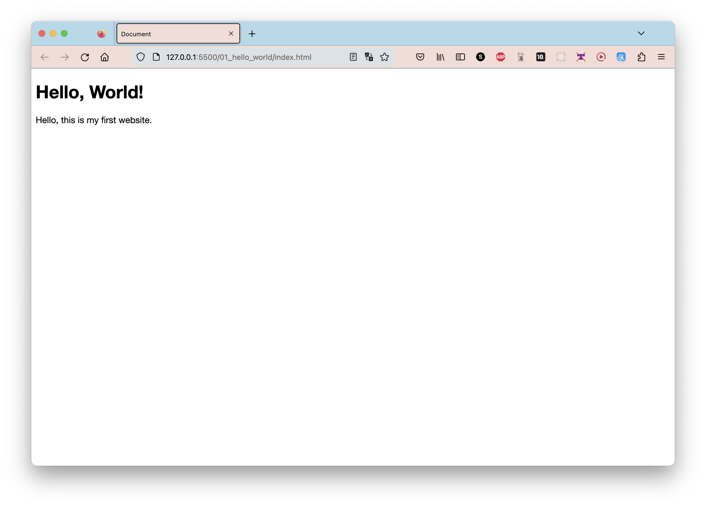

<sub>**Code Block 4 and Figure 10**: You will notice that the paragraph tag looks very similar to the way our tag-less text does. That's because they are actually styled the same way. The paragraph tag contains a few extra "hidden" features, but those don't matter too much at the moment.</sub>

One thing to note about the paragraph tag is that, unlike the header tags, it does not place the next element of your website underneath it. What this means is that if you have multiple paragraphs, you cannot do this:

```html
<!-- Website Content -->
<body>
    <h1>Hello, World</h1>

    <p>
        Hello, this is my first website.

        It ain't much, but it's honest work.
    </p>
</body>
```

Or

```html
<!-- Website Content -->
<body>
    <h1>Hello, World</h1>

    <p>Hello, this is my first website.</p>
    <p>It ain't much, but it's honest work.</p>
</body>
```

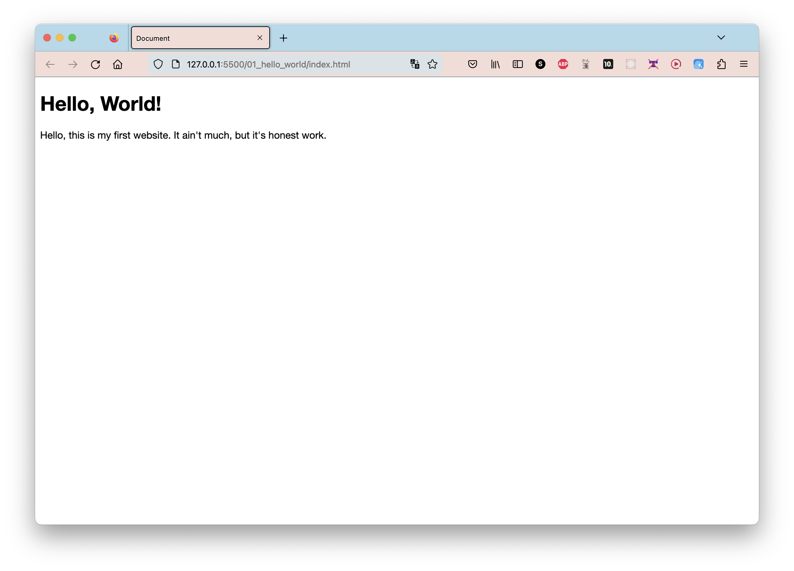

<sub>**Code Block 5 and Figure 11**: Not exactly what we wanted.</sub>

Instead, be sure to create **two separate paragraph tags** and, between them, add a **line break** tag, or **`<br></br>`**:

```html
<!-- Website Content -->
<body>
    <h1>Hello, World!</h1>

    <p>Hello, this is my first website.</p>
    <br></br>
    <p>It ain't much, but it's honest work.</p>
</body>
```

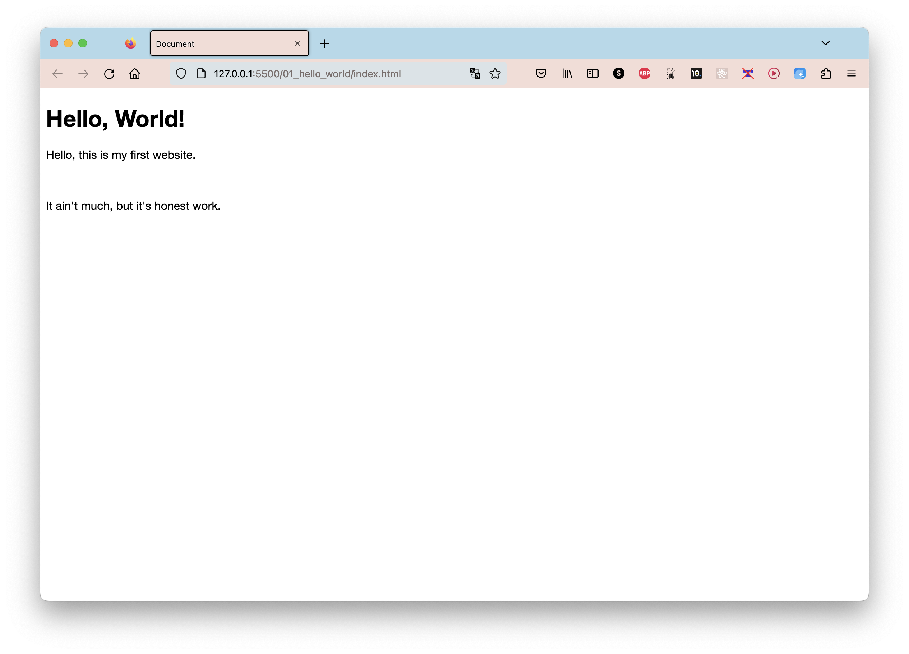

<sub>**Code Block 6 and Figure 12**: There we go. The space between the two paragraphs looks a bit too large, doesn't it. We'll be able to fix that eventually, don't worry.</sub>

---

The last tag we'll talk about today is the image, or `</img>` tag. As the name implies, places an image into your website. Let's say I wanted to place this Monet into my website:


<sub>**Figure 13**: Let's say this file is called `art.gif`.</sub>

This is actually pretty simple. Follow the following steps:

1. Place the image file in the same folder as your `index.html` file.
2. Place an image tag wherever you want your image to be:

```html
<!-- Website Content -->
<body>
    <h1>Hello, World!</h1>

    <p>Hello, this is my first website.</p>
    <br></br>

    </img>

    <p>It ain't much, but it's honest work.</p>
</body>
```

3. **Inside the first part of the image tag (i.e. the `` part), write the following:

```html
</img>
```

Of course, replace `pace.gif` with the name of the image you are actually using.

If everything goes smoothly, your site should look like this now:

```html
<!-- Website Content -->
<body>
    <h1>Hello, World!</h1>

    <p>Hello, this is my first website.</p>
    <br>

    

    <p>It ain't much, but it's honest work.</p>
</body>
```
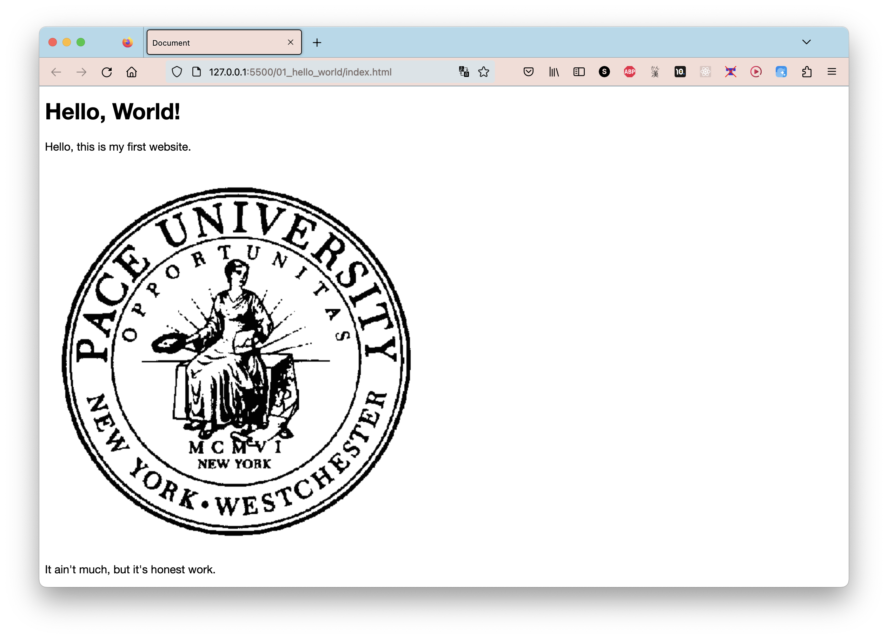

<sub>**Code Block 7 and Figure 14**: Awesome. Notice that, like the header 1 tag and unlike the paragraph tag, the image tag _does_ place the following tags **below it**.</sub>

### Part 3: _Homework_

Your homework assignment is very simple: turn your video introduction from the discussion in week 1 into a website using the HTML that we learned today. Your finished HTML file must contain:

- At least one header 1 tag (`<h1></h1>`).
- At least one header tag of a different size. We didn't explicitly talk about these, but once you start using them, you'll see how they work right away. The other sizes are:
    - **Header 2**: `<h2></h2>`
    - **Header 3**: `<h3></h3>`
    - **Header 4**: `<h4></h4>`
    - **Header 5**: `<h5></h5>`
    - **Header 6**: `<h6></h6>`
- At least **four** paragraph tags.
- At least **three** image tags that correctly load actual image files. Please include the image files that you use in your submission.

Once you are finished, go ahead and submit your HTML and image files [**here**]().