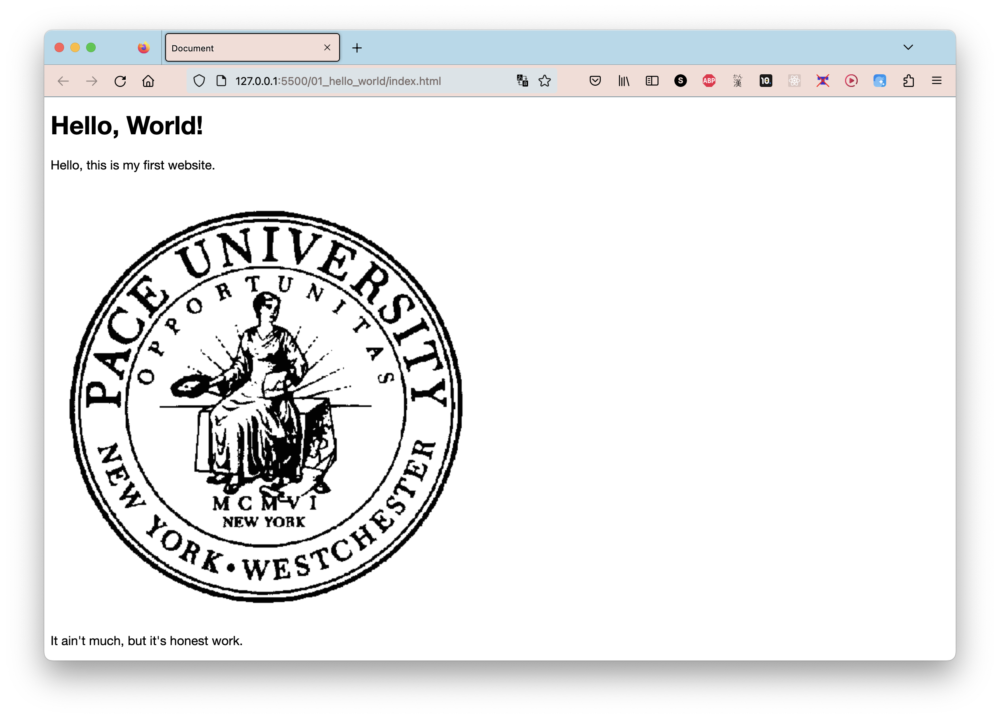
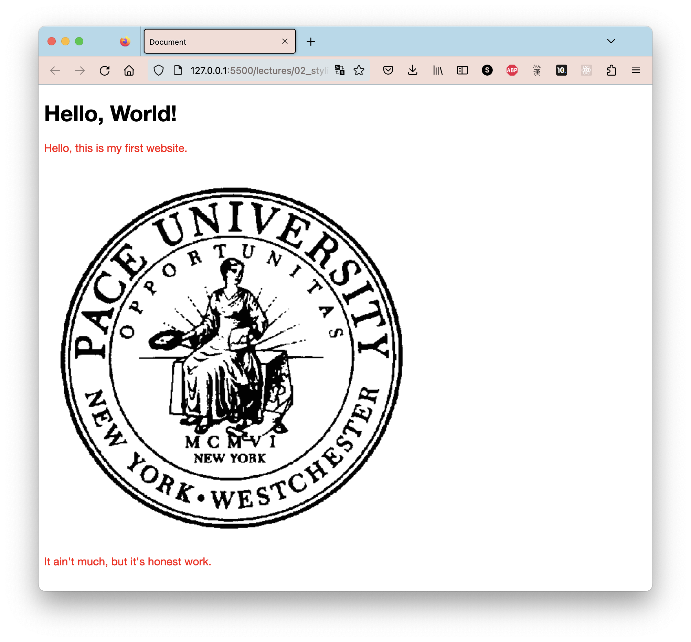
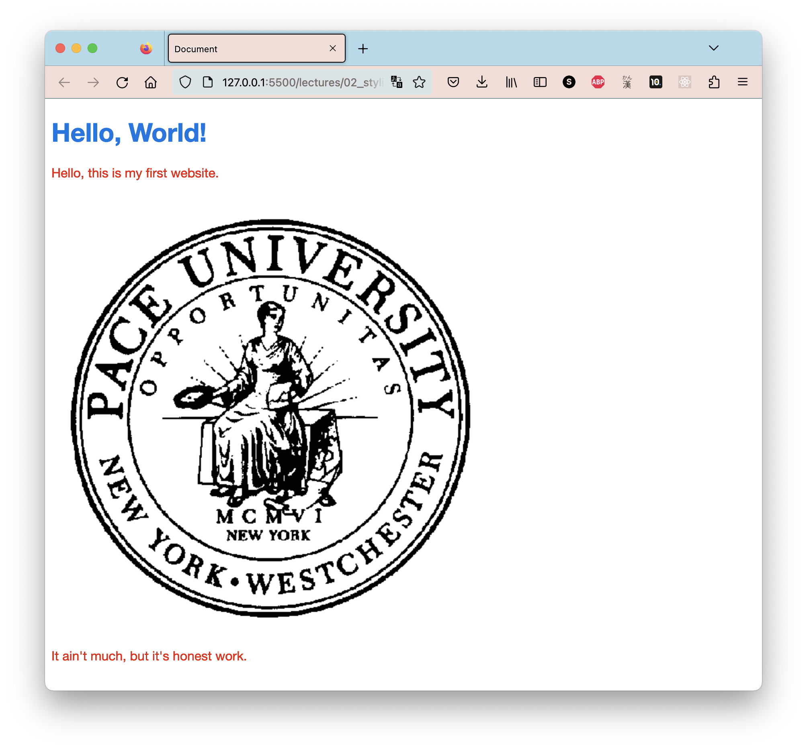
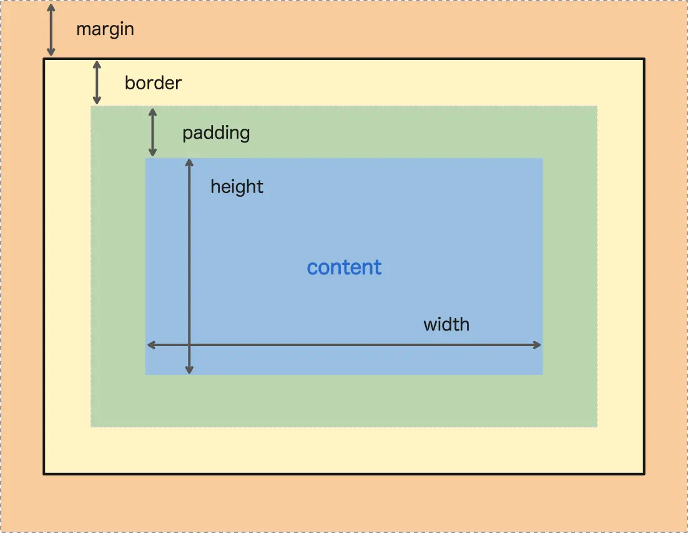
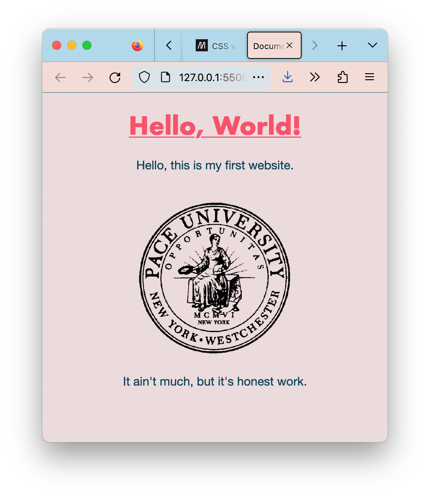
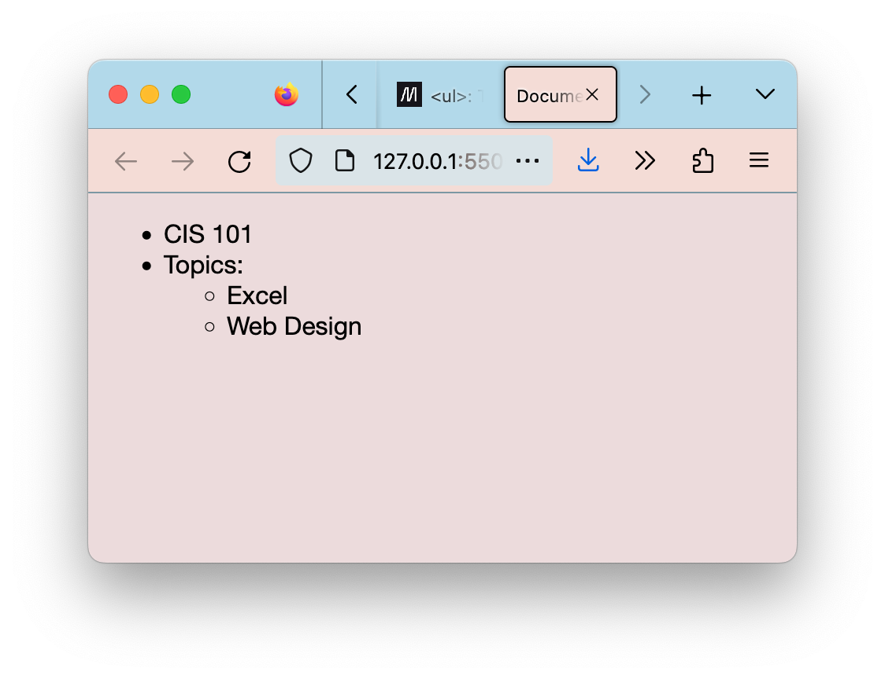

<h2 align=center>Lecture 02</h2>

<h1 align=center>CSS Styling</h1>

<h3 align=center>8 Germinal, Year CCXXXI</h3>

***Song of the day:*** _[**Burning Love**](https://youtu.be/kUtHCZBR8c4) by Elvis Presley and The Royal Philharmonic Orchestra (2015)._

---

### Sections

1. [**CSS**](#part-1-css)
2. [**How CSS Is Written**](#part-2-how-css-is-written)
3. [**CSS Styling Options**](#part-3-css-styling-options)
4. [**A Couple More HTML Tags**](#part-4-a-couple-more-html-tags)
4. [**Homework**](#part-5-homework)

### Part 1: _Introducing CSS_

We left off with our website looking like this:



<sub>**Figure 1**: A subpar experience.</sub>

Which _is_ a website. Back in the 80s and early 90s, this is what websites looked like all the time, before web design as a field really took off. After completing [**homework assignment 01**](https://github.com/sebastianromerocruz/cis-101-final-project-material/tree/main/lectures/01_hello_world#part-3-homework), however, you were probably left with much to be desired. For example, you might've asked yourself:

- Can I change the font to another style?
- Can I add colour to the font?
- Can I center the text instead of it being aligned to the left?
- Why are my pictures so damn _large_?

All of these questions belong to the realm of a website's **style**, and are, for the most part, controlled by something called [**CSS**](https://developer.mozilla.org/en-US/docs/Learn/CSS/First_steps/What_is_CSS), or _cascading style sheets_. You can think of CSS as a special sort of "language" used alongside [**HTML**](https://github.com/sebastianromerocruz/cis-101-final-project-material/tree/main/lectures/01_hello_world#step-2-creating-your-html-file) in order to make really nice-looking websites. While CSS is notoriously difficult to _master_, getting started with it is super easy. Let's look at how.

### Part 2: _How CSS Is Written_

Take a look at our [**`index.html` file**](index.html):

```html
<!DOCTYPE html>
<html lang="en">
    <!-- Website Head -->
    <head>
        <meta charset="UTF-8">
        <meta http-equiv="X-UA-Compatible" content="IE=edge">
        <meta name="viewport" content="width=device-width, initial-scale=1.0">
        <title>Document</title>
    </head>


    <!-- Website Styling -->
    <style>

    </style>


    <!-- Website Content -->
    <body>
        <h1>Hello, World!</h1>

        <p>Hello, this is my first website.</p>
        <br>

        

        <p>It ain't much, but it's honest work.</p>
    </body>


    <!-- Website Interactivity -->
    <script>

    </script>
</html>
```

See where that `<style></style>` html block is? That's exactly where our CSS will go. Usually, we would write all of our CSS in a separate file and then import it into our html file, but we're gonna keep it simple for this project.

The best way to explain this is by showing you. Inside the `<style></style>` html block, type the following lines:

```css
p {
    color: red;
}
```

<sub>**Code Block 1**: Adding the colour red to our paragraph tags.</sub>

Now, go live on your server and check out the result:



<sub>**Figure 2**: We leave the monochrome.</sub>

So, what just happened? What code block 1 is telling the website to do is the following:

> To **every** paragraph (`<p></p>`) tag, apply the **`color`** styling **`red`**.

`color` is one the CSS attributes that you can apply to your html elements. You can also use [**hexadecimal codes**](https://www.color-hex.com/) as well instead of the names of colours like `red` or `yellow`. This is actually the standard, so I'm gonna switch my CSS from above to to a hex code. I'm also going to add colour to my header tag `<h1></h1>`:

```css
p {
    color: #EC1802;
}

h1 {
    color: #0073E5;
}
```



<sub>**Figure 3**: Now, two elements have `color` styling.</sub>

### Part 3: _CSS Styling Options_

CSS has [**a _lot_**](https://developer.mozilla.org/en-US/docs/Web/CSS/Reference#index) of styling options, the vast majority of which we will not worry about in this class. I'm gonna list a few of the most common ones, and the ones that you'll need for your final project.

- [**`color`**](https://developer.mozilla.org/en-US/docs/Web/CSS/color): What we saw earlier. While there are multiple ways to choose colours, I recommend you stick to colour names and hex codes.
- [**`width`**](https://developer.mozilla.org/en-US/docs/Web/CSS/width) / [**`height`**](https://developer.mozilla.org/en-US/docs/Web/CSS/height): Wanna change the dimensions of your image? Here's your ticket. For images, you only need to change one of these dimensions in order to shrink it while keeping the same proportions. There are a couple of ways to do this:
    - **Pixels (`px`)**: This is just a standard measurement of pixels on the screen. Play around with the values to get a feel of what number of pixels is a lot and what number of pixels is a little.
    - **`em`**: Another unit of size measurement, larger than pixels.
    - **Percentage (`%`)**: The percentage relative of the size of the parent element. In our case, the parent element is the body of the website (we'll learn about making smaller parent elements in the next section). So, if you make your image `50%`, it will grow and shrink with the window to remain 50% the size of it.
- [**`text-align`**](https://developer.mozilla.org/en-US/docs/Web/CSS/text-align): Although the name suggests that this aligns text only, this styling option will center everything _inside of the element to which it is applied to_. What this means is that, if you applied, say, `text-align: center;` to the `body` tag (i.e., the whole website), every element _inside_ of the body of the website would be centered (see example below).
- [**`font-size`**](https://developer.mozilla.org/en-US/docs/Web/CSS/font-size): Pretty much exactly as it sounds like. You can use the same sizing options as you did with `width` and `height`.
- [**`font-family`**](https://developer.mozilla.org/en-US/docs/Web/CSS/font-family): Self-explanatory, you can change the type of font being used in your website. Different computers come equipped with different built-in font styles, so try to pick common ones like [**these**](https://www.w3schools.com/csSref/css_websafe_fonts.php).
- [**`text-decoration`**](https://developer.mozilla.org/en-US/docs/Web/CSS/text-decoration): This includes underlining, overlining, and strikethroughs. Take a look at the examples in the link provided.
- **Spacing Properties**: These are a bit difficult to explain succinctly (see diagram below). Basically, every element has the following spacing properties at each of its four sides, which you can set using the units explained in `width` and `height`:
    - [**`margin`**](https://developer.mozilla.org/en-US/docs/Web/CSS/margin): This is the distance between an element's border (see bullet point below) to another element.
    - [**`border`**](https://developer.mozilla.org/en-US/docs/Web/CSS/border): This is the width of the surrounding "barrier" (which, by default, is invisible) of an element.
    - [**`padding`**](https://developer.mozilla.org/en-US/docs/Web/CSS/padding): This is the distance between an element's border to the actual element.



<sub>**Figure 4**: A visual representation of `margin`, `border`, and `padding`. Note that all four sides need not have the same value.</sub>

There are multiple ways to apply values for spacing properties, but for simplicity, make sure to explicitly give the values of each side. For example, if we wanted our `` to have a top padding of 3%, a right padding of 50%, and bottom padding of 20%, and a left padding of 0%, we would do the following:

```css
img {
    padding: 3% 50% 20% 0%;
}
```

These are all the ones I'd like you to use for now, but we'll introduce a couple of more over the following lectures. The following styling, therefore:

```css
body {
    text-align: center;
    background-color: #ecdbdc;
}

p {
    color: #0a465d;
}

h1 {
    color: #f8526c;
    font-family: 'Futura';
    text-decoration: underline;
}

img {
    width: 50%;
    margin: auto 10% auto 10%
}
```

Will result in the following:



<sub>**Figure 5**: It's starting to feel like we might be able to make this nicer, doesn't it? Notice that I didn't explicitly introduce `background-color`, but you can probably guess what it does.</sub>

### Part 4: _A Couple More HTML Tags_

Four more HTML tags that you should be aware of are the following:

- [**`ul` and `li`**](https://developer.mozilla.org/en-US/docs/Web/HTML/Element/ul): You can use these to create unordered lists, as such:

```html
<ul>
    <li>CIS 101</li>
    <li>Topics:
        <ul>
            <li>Excel</li>
            <li>Web Design</li>
        </ul>
    </li>
</ul>
```

Output:



<sub>**Figure 6**: An unordered list. Note that I had to remove the `text-align: center;` for it to look like this.</sub>

- [**`em`, or emphasis**](https://developer.mozilla.org/en-US/docs/Web/HTML/Element/em): Basically what italicises text in CSS.
- [**`strong`**](https://developer.mozilla.org/en-US/docs/Web/HTML/Element/strong): Basically what bolds text in CSS.

### Part 5: _Homework_

Your assignment this week is modify your `index.html` file from last week and include:
- At least one instance of **every** CSS styling we discussed in [**class**](#part-3-css-styling-options) today. These can be wherever, so no stress.
- At least one instance of **each of the four** HTML tags that were introduced [**today**](#part-4-a-couple-more-html-tags).

You can submit your assignment on [**Classes**](https://classes.pace.edu/d2l/lms/dropbox/user/folders_list.d2l?ou=365894&isprv=0). As usual, it is due next Wednesday, 4/5, at 11:59pm.